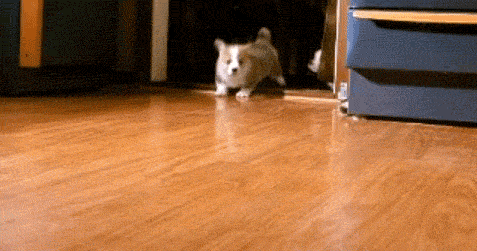

# Javascript Assíncrono

## Atividade: API "dogAPI"

Nesta atividade, vamos criar uma página que carrega fotos aleatórias de doguinhos sempre que clicamos em um botão.

1. Utilize a API `https://dog.ceo/api/breeds/image/random` para fazer as chamadas com o método `fetch()`;
2. Utilize seus conhecimentos na manipulação do DOM para criar a imagem e ativar o evento de clique do botão!

## Demo

